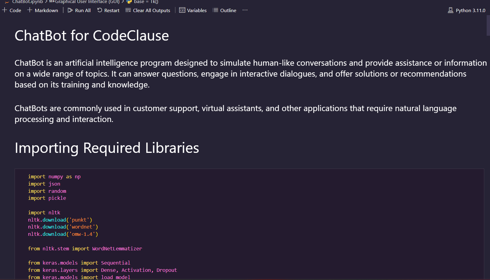
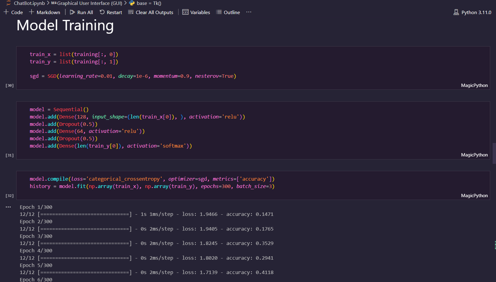
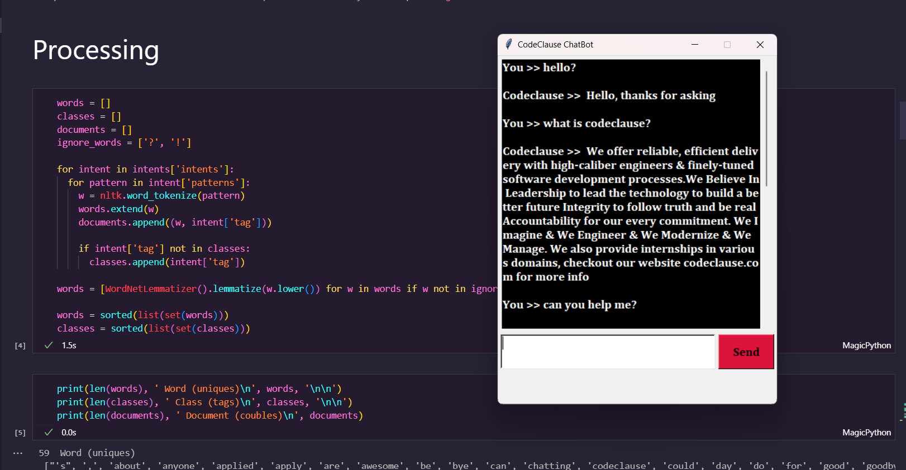

# ChatBot for CodeClause
<br><br>


## 📌 Problem Definition

⚪ Develop a ChatBot for CodeClause to provide `coding assistance, personalized recommendations, and interactive learning experience` for users.<br><br>
⚪ The ChatBot should respond to ```coding queries, offer guidance on coding challenges, provide accurate information on programming languages and best practices```, and assist in debugging code.  <br><br>

⚪ It should analyze user preferences and history to offer `personalized recommendations` for exercises, tutorials, and resources. <br><br>
⚪ The ChatBot should enhance the learning experience by engaging users in `interactive learning activities`.<br><br>


## 👀 Screenshots






https://github.com/Abhiram-Laha/CodeClause-Data-Science/assets/90309476/a6bfbabc-2cdc-421a-8f22-6e3c518610e8


<br>

## 👉 Application

The CodeClause ChatBot is an application that provides coding assistance, personalized recommendations, and interactive learning.<br><br>
It has a user-friendly interface, understands coding queries, offers guidance on programming languages and debugging code, and suggests personalized exercises and resources.<br><br>
It integrates with the CodeClause platform and improves based on user feedback.


## ✍️ Authors

- [Abhiram Laha](https://github.com/Abhiram-Laha)

<br>
